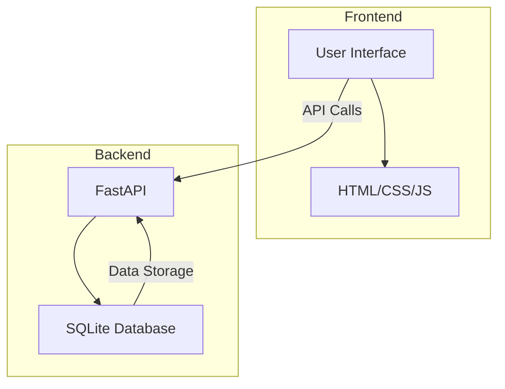

# AI-Powered Health Risk Assessment Tool

## Overview
The AI-Powered Health Risk Assessment Tool is an innovative application designed to provide users with personalized health insights through advanced AI algorithms. By analyzing user profiles that include age, lifestyle, family history, and specific health metrics, the tool assesses health risks and offers actionable recommendations. This project is particularly beneficial for individuals seeking to understand their health better and healthcare professionals looking to provide data-driven advice to their patients.

This application addresses the growing need for personalized healthcare solutions by offering a user-friendly interface combined with powerful backend analytics. Users can create profiles, receive health risk assessments, and view recommendations to improve their lifestyle. The tool's integration with FastAPI ensures a seamless experience with robust API capabilities.

## Features
- **User Profile Management**: Create and manage user profiles with detailed health metrics.
- **Health Risk Assessment**: Generate personalized risk scores and recommendations based on user data.
- **Interactive UI**: Navigate through a clean and responsive web interface.
- **API Documentation**: Access comprehensive API documentation for developers.
- **Data Persistence**: Store user profiles and assessments in a SQLite database.
- **CORS Support**: Allow cross-origin requests to enable flexible integrations.
- **Responsive Design**: Utilize Bootstrap for a mobile-friendly user experience.

## Tech Stack
| Component       | Technology    |
|-----------------|---------------|
| Backend         | FastAPI       |
| Frontend        | HTML/CSS/JS   |
| Styling         | Bootstrap 5   |
| Database        | SQLite        |
| Templating      | Jinja2        |
| Server          | Uvicorn       |

## Architecture
The project is structured with a FastAPI backend serving a static HTML/CSS/JS frontend. The backend exposes several API endpoints to manage user profiles and health assessments. Data is stored in a SQLite database with two main tables: `UserProfile` and `HealthAssessment`. The frontend interacts with the backend through these API endpoints, allowing users to submit and retrieve data seamlessly.



## Getting Started

### Prerequisites
- Python 3.11+
- pip (Python package installer)
- Docker (optional for containerized deployment)

### Installation
1. Clone the repository:
   ```bash
   git clone https://github.com/yourusername/ai-powered-health-risk-assessment-tool-auto.git
   cd ai-powered-health-risk-assessment-tool-auto
   ```
2. Install the required Python packages:
   ```bash
   pip install -r requirements.txt
   ```

### Running the Application
1. Start the FastAPI application using Uvicorn:
   ```bash
   uvicorn app:app --reload
   ```
2. Open your web browser and visit `http://localhost:8000` to access the application.

## API Endpoints
| Method | Path                        | Description                                      |
|--------|-----------------------------|--------------------------------------------------|
| GET    | /api/profiles               | Retrieves all user profiles.                     |
| POST   | /api/profiles               | Creates a new user profile.                      |
| GET    | /api/assessments/{profile_id} | Returns a health risk assessment for a profile. |
| POST   | /api/assessments            | Generates a new health risk assessment.          |

## Project Structure
```
.
├── app.py                   # Main application file with FastAPI routes
├── Dockerfile               # Docker configuration file
├── requirements.txt         # Python dependencies
├── start.sh                 # Shell script to start the application
├── static
│   ├── css
│   │   └── style.css        # Custom styles for the application
│   └── js
│       └── main.js          # JavaScript for interactive elements
├── templates
│   ├── about.html           # About page template
│   ├── api_docs.html        # API documentation page template
│   ├── assessment.html      # Assessment results page template
│   ├── index.html           # Home page template
│   └── profile.html         # User profile creation page template
└── health_assessment.db     # SQLite database file
```

## Screenshots
*Screenshots of the application interface will be added here.*

## Docker Deployment
To deploy the application using Docker, follow these steps:
1. Build the Docker image:
   ```bash
   docker build -t ai-health-assessment .
   ```
2. Run the Docker container:
   ```bash
   docker run -d -p 8000:8000 ai-health-assessment
   ```

## Contributing
Contributions are welcome! Please follow these guidelines:
- Fork the repository.
- Create a new branch for your feature or bugfix.
- Commit your changes with clear messages.
- Push to your fork and submit a pull request.

## License
This project is licensed under the MIT License.

---
Built with Python and FastAPI.